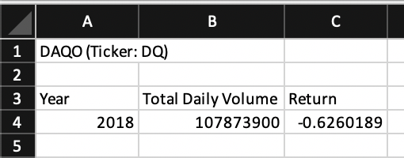
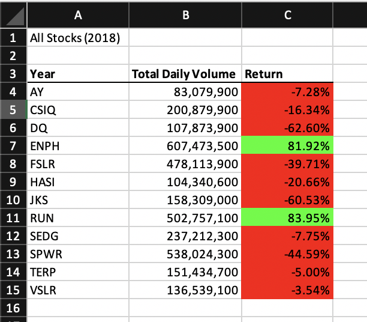
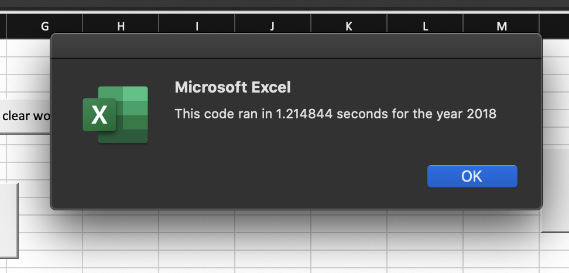
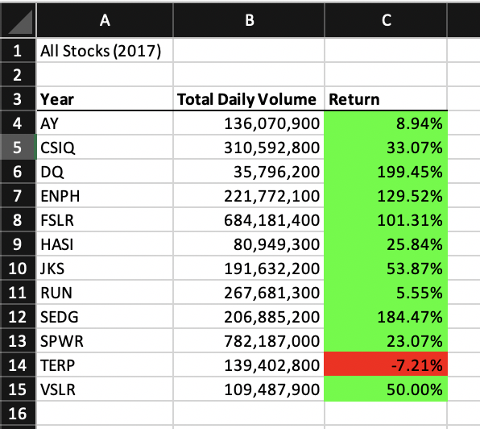
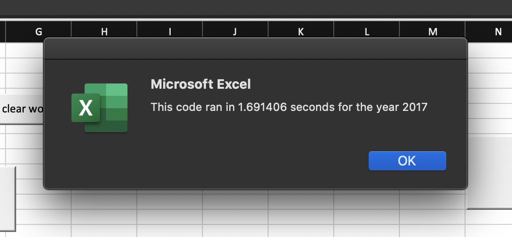
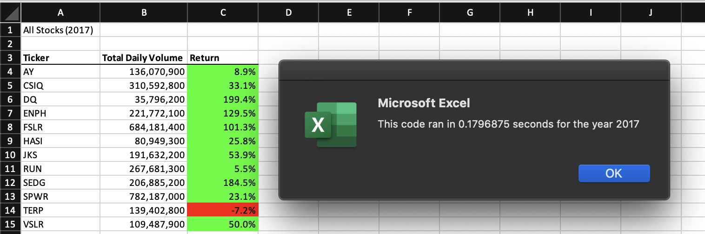
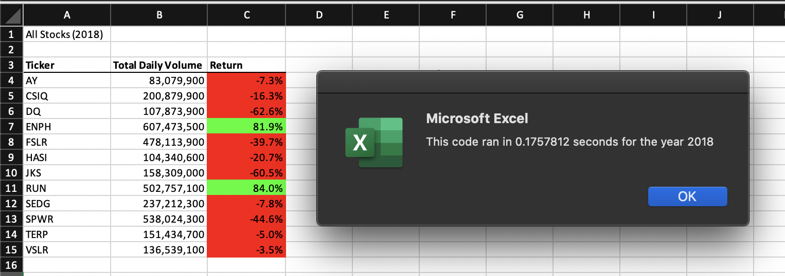

# STOCK ANALYSIS 

### OVERVIEW: VBA Stock Analysis Project

A stock is an investment that represents a share, or partial ownership, of a company. Stocks are one of the best ways to build wealth. 

In this project we have a dataset in excel that contains a little over 3000 daily records for daily volume exchanged per stock, for the years 2017 and 2018. 

### Purpose

In order to figure out which stocks perform best were going to look at how each stock performed over the year, by analyzing the total volume of exchange and the yearly return.

## Analysis and Challenges

### Challenges:

The data set is made up of exactly 3013 example which is a tiny percentage of the real number of exchanges made over the year. based on how limited it is, the analysis can’t be considered to be conclusive and should serve for familiarization purposes only.

### Analysis:

#### Analyzing 'DQ'

 the client is interested in a specific stock 'DADQ' with the ticker 'DQ'.
 for that in vba we are going to build a script that calculates the total yearly traded volume based on the daily volumes for the ticker 'DQ'.
 - CODE looks like:
 
 ```vba
 Sub DQAnalysis()
Worksheets("DQAnalysis").Activate
Range("A1").Value = "DAQO (Ticker: DQ)"
'Create a header row
Cells(3, 1).Value = "Year"
Cells(3, 2).Value = "Total Daily Volume"
Cells(3, 3).Value = "Return"  
Worksheets("2018").Activate
totalVolume = 0

 Dim startingPrice As Double
 Dim endingPrice As Double
 rowStart = 2
'DELETE: rowEnd = 3013
'rowEnd code taken from https://stackoverflow.com/questions/18088729/row-count-where-data-exists
 rowEnd = Cells(Rows.Count, "A").End(xlUp).Row

For i = rowStart To rowEnd
    'increase totalVolume
     If Cells(i, 1).Value = "DQ" Then
        totalVolume = totalVolume + Cells(i, 8).Value
        End If
     If Cells(i - 1, 1).Value <> "DQ" And Cells(i, 1).Value = "DQ" Then
            startingPrice = Cells(i, 6).Value
        End If
        If Cells(i + 1, 1).Value <> "DQ" And Cells(i, 1).Value = "DQ" Then
            endingPrice = Cells(i, 6).Value
        End If
Next i
    Worksheets("DQAnalysis").Activate
    Cells(4, 1).Value = 2018
    Cells(4, 2).Value = totalVolume
    Cells(4, 3).Value = (endingPrice / startingPrice) - 1
End Sub
 ```
 
 the output looks like:
 
 
 - we can now see how DADQ did overall over the year.
 - 
#### Analyzing all stocks.

in order to know where to situate our stock in comparison with the rest in the list. we are going to create a script that does the same thing we did for DQ, for all the different tickers and we’re going to do it by year.
- CODE 

 ```vbaSub AllStocksAnalysis()
Dim startTime As Single
Dim endTime  As Single
Worksheets("AllStocksAnalysis").Activate
yearValue = InputBox("What year would you like to run the analysis on?")
startTime = Timer
Range("A1").Value = "All Stocks (" + yearValue + ")"

'Create a header row
Cells(3, 1).Value = "Year"
Cells(3, 2).Value = "Total Daily Volume"
Cells(3, 3).Value = "Return"

Dim tickers(12) As String

    tickers(0) = "AY"
    tickers(1) = "CSIQ"
    tickers(2) = "DQ"
    tickers(3) = "ENPH"
    tickers(4) = "FSLR"
    tickers(5) = "HASI"
    tickers(6) = "JKS"
    tickers(7) = "RUN"
    tickers(8) = "SEDG"
    tickers(9) = "SPWR"
    tickers(10) = "TERP"
    tickers(11) = "VSLR"
    
Dim startingPrice As Single
Dim endingPrice As Single
Worksheets(yearValue).Activate
rowCount = Cells(Rows.Count, "A").End(xlUp).Row
    
    For i = 0 To 11
     ticker = tickers(i)
     totalVolume = 0   
     Worksheets(yearValue).Activate
        For j = 2 To rowCount
           'total volume for ticker
           If Cells(j, 1).Value = ticker Then
               totalVolume = totalVolume + Cells(j, 8).Value
           End If
           'starting price for ticker
           If Cells(j - 1, 1).Value <> ticker And Cells(j, 1).Value = ticker Then
               startingPrice = Cells(j, 6).Value
           End If
           'ending price for ticker
           If Cells(j + 1, 1).Value <> ticker And Cells(j, 1).Value = ticker Then
               endingPrice = Cells(j, 6).Value
           End If
        Next j
     Worksheets("AllStocksAnalysis").Activate
        
        Cells(4 + i, 1).Value = ticker
        Cells(4 + i, 2).Value = totalVolume
        Cells(4 + i, 3).Value = (endingPrice / startingPrice) - 1
    Next i
    endTime = Timer
    MsgBox "This code ran in " & (endTime - startTime) & " seconds for the year " & (yearValue) 
 End Sub 
 ```
 
 We add formatting to make it easier to visually make sense of the data, and a script that calculates how much time it took to run the script.
 
- The output looks like :
  
  
 
 ### Refactoring the code.
 
by looking at the runtimes, we can tell that the scripts are taking a little too long to run, a good way to solve that would be to refactor the code we wrote to analyze all the stocks and try to write it in a simpler way and avoid using too many loops that could take up too much of the hardware resources. 

- the new code would look like:

```vbaSub AllStocksAnalysisRefactored()
    Dim startTime As Single
    Dim endTime  As Single

    yearValue = InputBox("What year would you like to run the analysis on?")

    startTime = Timer
    
    'Format the output sheet on All Stocks Analysis worksheet
    Worksheets("AllStocksAnalysis").Activate
    
    Range("A1").Value = "All Stocks (" + yearValue + ")"
    
    'Create a header row
    Cells(3, 1).Value = "Ticker"
    Cells(3, 2).Value = "Total Daily Volume"
    Cells(3, 3).Value = "Return"

    'Initialize array of all tickers
    Dim tickers(12) As String
    
    tickers(0) = "AY"
    tickers(1) = "CSIQ"
    tickers(2) = "DQ"
    tickers(3) = "ENPH"
    tickers(4) = "FSLR"
    tickers(5) = "HASI"
    tickers(6) = "JKS"
    tickers(7) = "RUN"
    tickers(8) = "SEDG"
    tickers(9) = "SPWR"
    tickers(10) = "TERP"
    tickers(11) = "VSLR"
    
    'Activate data worksheet
    Worksheets(yearValue).Activate
    
    'Get the number of rows to loop over
    rowCount = Cells(Rows.Count, "A").End(xlUp).Row
    
    '1a) Create a ticker Index
    tickerIndex = 0

    '1b) Create three output arrays
    Dim tickerVolumes(12) As Long
    Dim tickerStartingPrices(12) As Single
    Dim tickerEndingPrices(12) As Single
    
    ''2a) Create a for loop to initialize the tickerVolumes to zero.
    For i = 0 To 11
        tickerVolumes(i) = 0
    Next i
       
    ''2b) Loop over all the rows in the spreadsheet.
    For i = 2 To rowCount
    
        '3a) Increase volume for current ticker
        tickerVolumes(tickerIndex) = tickerVolumes(tickerIndex) + Cells(i, 8).Value
      
        '3b) Check if the current row is the first row with the selected tickerIndex.
        'If  Then
        If Cells(i - 1, 1).Value <> tickers(tickerIndex) Then
            tickerStartingPrices(tickerIndex) = Cells(i, 6).Value
        End If
        'End If
        
        '3c) check if the current row is the last row with the selected ticker
         'If the next row’s ticker doesn’t match, increase the tickerIndex.
        'If  Then
            If Cells(i + 1, 1).Value <> tickers(tickerIndex) Then
            tickerEndingPrices(tickerIndex) = Cells(i, 6).Value
            
          '3d Increase the tickerIndex.
            tickerIndex = tickerIndex + 1
            'End If
        End If
    Next i
    
    '4) Loop through your arrays to output the Ticker, Total Daily Volume, and Return.
    For i = 0 To 11
        
    Worksheets("AllStocksAnalysis").Activate
        Cells(4 + i, 1).Value = tickers(i)
        Cells(4 + i, 2).Value = tickerVolumes(i)
        Cells(4 + i, 3).Value = tickerEndingPrices(i) / tickerStartingPrices(i) - 1
    Next i
    
    'Formatting
    
    Worksheets("AllStocksAnalysis").Activate
    Range("A3:C3").Font.FontStyle = "Bold"
    Range("A3:C3").Borders(xlEdgeBottom).LineStyle = xlContinuous
    Range("B4:B15").NumberFormat = "#,##0"
    Range("C4:C15").NumberFormat = "0.0%"
    Columns("B").AutoFit
    dataRowStart = 4
    dataRowEnd = 15

    For i = dataRowStart To dataRowEnd
        If Cells(i, 3) > 0 Then
           Cells(i, 3).Interior.Color = vbGreen
        Else
            Cells(i, 3).Interior.Color = vbRed        
        End If    
    Next i
 
    endTime = Timer
    MsgBox "This code ran in " & (endTime - startTime) & " seconds for the year " & (yearValue)
End Sub
```

 We added the same script to calculate the runtime, 
  and the new output looks like:
  
- For 2017:
  
  
- For 2018:
  
  
  we can clearly see the impact refactoring the code had on the runtime by reducing it significantly. 
  
 


